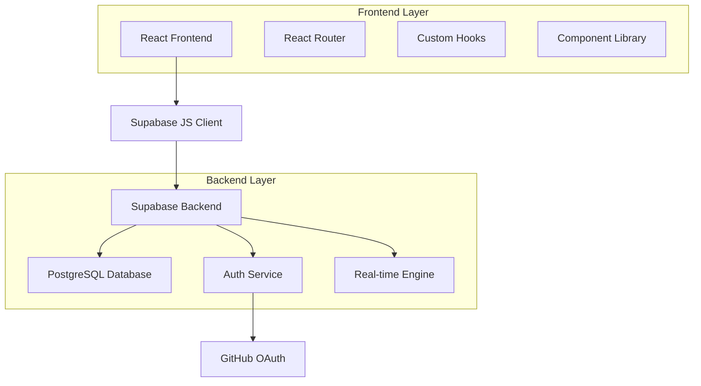

# Design Document

## Overview

IdeaVault is architected as a modern single-page application (SPA) using React with Vite as the build tool, Supabase as the backend-as-a-service platform, and Tailwind CSS with shadcn/ui for styling. The application follows a component-based architecture with custom hooks for state management and API interactions.

The system is designed for optimal developer experience with hot module replacement, TypeScript support, and a local-first development approach that doesn't require Docker or complex setup procedures.

## Architecture

### High-Level Architecture



### Technology Stack

- **Frontend Framework**: React 18 with Vite
- **Styling**: Tailwind CSS + shadcn/ui components
- **Routing**: React Router DOM
- **State Management**: React Context + Custom Hooks
- **Backend**: Supabase (PostgreSQL + Auth + Real-time)
- **Authentication**: GitHub OAuth via Supabase Auth
- **Build Tool**: Vite with HMR
- **Deployment**: Static hosting (Vercel/Netlify)

### Data Flow

1. **Authentication Flow**: User → GitHub OAuth → Supabase Auth → JWT Token → React Context
2. **Data Fetching**: Component → Custom Hook → Supabase Client → PostgreSQL → Real-time Updates
3. **State Management**: Supabase Real-time → Custom Hooks → React Context → Components

## Components and Interfaces

### Core Components

#### Layout Components
- **Navbar**: Navigation with authentication status, user avatar, and main navigation links
- **Layout**: Main application wrapper with consistent spacing and responsive design

#### Feature Components
- **IdeaCard**: Displays idea summary with title, description preview, tags, vote count, and author
- **IdeaForm**: Form for submitting new ideas with validation and tag management
- **VoteButton**: Interactive voting component with optimistic updates and authentication checks
- **TagFilter**: Multi-select tag filtering with search and clear functionality
- **IdeaDetail**: Full idea view with complete description, voting, and metadata

#### Page Components
- **Home**: Main landing page with idea list, filtering, and search
- **Submit**: Idea submission page with form and validation
- **IdeaDetail**: Individual idea page with full content and interactions
- **Profile**: User profile with submitted ideas and statistics
- **About**: Platform information and usage guidelines

### Custom Hooks

#### Authentication Hooks
```javascript
// useAuth.js
const useAuth = () => ({
  user: User | null,
  loading: boolean,
  signIn: () => Promise<void>,
  signOut: () => Promise<void>,
  session: Session | null
})
```

#### Data Hooks
```javascript
// useIdeas.js
const useIdeas = (filters?: FilterOptions) => ({
  ideas: Idea[],
  loading: boolean,
  error: Error | null,
  refetch: () => Promise<void>,
  hasMore: boolean,
  loadMore: () => Promise<void>
})

// useVote.js
const useVote = (ideaId: string) => ({
  hasVoted: boolean,
  voteCount: number,
  toggleVote: () => Promise<void>,
  loading: boolean
})
```

### API Interfaces

#### Supabase Client Configuration
```javascript
// supabaseClient.js
export const supabase = createClient(
  process.env.VITE_SUPABASE_URL,
  process.env.VITE_SUPABASE_ANON_KEY,
  {
    auth: {
      autoRefreshToken: true,
      persistSession: true,
      detectSessionInUrl: true
    },
    realtime: {
      params: {
        eventsPerSecond: 10
      }
    }
  }
)
```

## Data Models

### Database Schema

#### Ideas Table
```sql
CREATE TABLE ideas (
  id UUID PRIMARY KEY DEFAULT gen_random_uuid(),
  author_id UUID REFERENCES auth.users(id) ON DELETE CASCADE,
  title TEXT NOT NULL CHECK (length(title) >= 3 AND length(title) <= 200),
  description TEXT NOT NULL CHECK (length(description) >= 10),
  tags TEXT[] DEFAULT '{}',
  votes INTEGER DEFAULT 0,
  created_at TIMESTAMPTZ DEFAULT NOW(),
  updated_at TIMESTAMPTZ DEFAULT NOW()
);

-- Indexes for performance
CREATE INDEX idx_ideas_author_id ON ideas(author_id);
CREATE INDEX idx_ideas_created_at ON ideas(created_at DESC);
CREATE INDEX idx_ideas_votes ON ideas(votes DESC);
CREATE INDEX idx_ideas_tags ON ideas USING GIN(tags);
```

#### Idea Votes Table
```sql
CREATE TABLE idea_votes (
  id UUID PRIMARY KEY DEFAULT gen_random_uuid(),
  idea_id UUID REFERENCES ideas(id) ON DELETE CASCADE,
  user_id UUID REFERENCES auth.users(id) ON DELETE CASCADE,
  created_at TIMESTAMPTZ DEFAULT NOW(),
  UNIQUE(idea_id, user_id)
);

-- Indexes
CREATE INDEX idx_idea_votes_idea_id ON idea_votes(idea_id);
CREATE INDEX idx_idea_votes_user_id ON idea_votes(user_id);
```

#### Comments Table (Future Enhancement)
```sql
CREATE TABLE comments (
  id UUID PRIMARY KEY DEFAULT gen_random_uuid(),
  idea_id UUID REFERENCES ideas(id) ON DELETE CASCADE,
  user_id UUID REFERENCES auth.users(id) ON DELETE CASCADE,
  content TEXT NOT NULL CHECK (length(content) >= 1 AND length(content) <= 1000),
  created_at TIMESTAMPTZ DEFAULT NOW(),
  updated_at TIMESTAMPTZ DEFAULT NOW()
);
```

### TypeScript Interfaces

```typescript
interface User {
  id: string;
  email: string;
  user_metadata: {
    avatar_url: string;
    full_name: string;
    user_name: string;
  };
}

interface Idea {
  id: string;
  author_id: string;
  title: string;
  description: string;
  tags: string[];
  votes: number;
  created_at: string;
  updated_at: string;
  author?: {
    user_name: string;
    avatar_url: string;
  };
  user_vote?: boolean;
}

interface IdeaVote {
  id: string;
  idea_id: string;
  user_id: string;
  created_at: string;
}

interface FilterOptions {
  tags?: string[];
  author?: string;
  sortBy?: 'created_at' | 'votes' | 'title';
  sortOrder?: 'asc' | 'desc';
}
```

## Error Handling

### Client-Side Error Handling

#### Authentication Errors
- **OAuth Failures**: Display user-friendly message with retry option
- **Session Expiry**: Automatic token refresh with fallback to re-authentication
- **Permission Errors**: Clear messaging about required authentication

#### API Errors
- **Network Failures**: Retry mechanism with exponential backoff
- **Validation Errors**: Field-specific error messages in forms
- **Rate Limiting**: Graceful degradation with user notification

#### Real-time Connection Errors
- **Connection Loss**: Automatic reconnection with visual indicator
- **Subscription Failures**: Fallback to polling with user notification

### Error Boundary Implementation
```javascript
class ErrorBoundary extends React.Component {
  constructor(props) {
    super(props);
    this.state = { hasError: false, error: null };
  }

  static getDerivedStateFromError(error) {
    return { hasError: true, error };
  }

  componentDidCatch(error, errorInfo) {
    console.error('Application error:', error, errorInfo);
    // Optional: Send to error reporting service
  }

  render() {
    if (this.state.hasError) {
      return <ErrorFallback error={this.state.error} />;
    }
    return this.props.children;
  }
}
```

### Database Error Handling

#### Row Level Security (RLS)
```sql
-- Enable RLS on all tables
ALTER TABLE ideas ENABLE ROW LEVEL SECURITY;
ALTER TABLE idea_votes ENABLE ROW LEVEL SECURITY;

-- Ideas policies
CREATE POLICY "Ideas are viewable by everyone" ON ideas
  FOR SELECT USING (true);

CREATE POLICY "Users can insert their own ideas" ON ideas
  FOR INSERT WITH CHECK (auth.uid() = author_id);

CREATE POLICY "Users can update their own ideas" ON ideas
  FOR UPDATE USING (auth.uid() = author_id);

-- Vote policies
CREATE POLICY "Votes are viewable by everyone" ON idea_votes
  FOR SELECT USING (true);

CREATE POLICY "Users can manage their own votes" ON idea_votes
  FOR ALL USING (auth.uid() = user_id);
```

## Testing Strategy

### Unit Testing
- **Component Testing**: React Testing Library for component behavior
- **Hook Testing**: Custom hook testing with React Hooks Testing Library
- **Utility Testing**: Pure function testing with Jest

### Integration Testing
- **API Integration**: Supabase client integration tests
- **Authentication Flow**: End-to-end authentication testing
- **Real-time Features**: WebSocket connection and subscription testing

### End-to-End Testing
- **User Workflows**: Critical path testing with Playwright or Cypress
- **Cross-browser Testing**: Chrome, Firefox, Safari compatibility
- **Mobile Responsiveness**: Touch interactions and responsive design

### Performance Testing
- **Bundle Size**: Webpack Bundle Analyzer for optimization
- **Load Testing**: Supabase connection limits and response times
- **Real-time Performance**: WebSocket message handling under load

### Testing Configuration
```javascript
// vitest.config.js
export default defineConfig({
  plugins: [react()],
  test: {
    globals: true,
    environment: 'jsdom',
    setupFiles: ['./src/test/setup.js'],
    coverage: {
      reporter: ['text', 'json', 'html'],
      exclude: ['node_modules/', 'src/test/']
    }
  }
});
```

### Mock Strategy
- **Supabase Client**: Mock implementation for unit tests
- **GitHub OAuth**: Mock authentication flow
- **Real-time Subscriptions**: Mock WebSocket connections

## Security Considerations

### Authentication Security
- **JWT Token Management**: Secure storage and automatic refresh
- **OAuth State Validation**: CSRF protection for GitHub OAuth
- **Session Management**: Secure session handling with httpOnly cookies

### Data Security
- **Input Validation**: Client and server-side validation
- **XSS Prevention**: Content sanitization and CSP headers
- **SQL Injection**: Parameterized queries through Supabase client

### API Security
- **Rate Limiting**: Supabase built-in rate limiting
- **CORS Configuration**: Proper origin restrictions
- **Environment Variables**: Secure handling of API keys

## Performance Optimization

### Frontend Optimization
- **Code Splitting**: Route-based lazy loading
- **Bundle Optimization**: Tree shaking and minification
- **Image Optimization**: WebP format with fallbacks
- **Caching Strategy**: Service worker for static assets

### Database Optimization
- **Query Optimization**: Proper indexing and query structure
- **Connection Pooling**: Supabase connection management
- **Real-time Optimization**: Selective subscriptions and filtering

### Deployment Optimization
- **Static Generation**: Pre-built static assets
- **CDN Integration**: Global content delivery
- **Compression**: Gzip/Brotli compression for assets